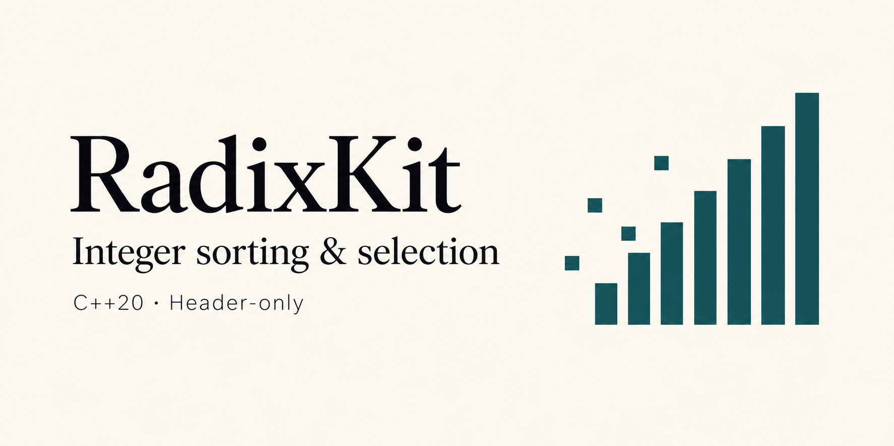

Header-only C++20 sorting and selection for **unsigned 32-bit and 64-bit integers**
and records with payloads. [MIT licensed](LICENSE); the library depends only on
the C++ standard library.

```cpp
#include <radixkit/radixkit.hpp>
#include <vector>

std::vector<std::uint32_t> values{9, 1, 7, 7, 3};
radixkit::sort(values);           // 1, 3, 7, 7, 9
radixkit::top_k(values, 3);       // Three largest values in the prefix, unordered

std::vector<radixkit::key_value64> rows{{9, 100}, {2, 200}, {9, 300}};
radixkit::sort(rows);             // Ascending keys, with payloads preserved
```

## Operations

| Function | Result |
|---|---|
| `sort(values)` | Entire input sorted ascending |
| `nth_element(values, nth)` | Element at zero-based rank `nth` in its final position, with both sides partitioned |
| `partial_sort(values, k)` | Smallest `k` elements sorted in the prefix |
| `top_k(values, k)` | Largest `k` elements in an unordered prefix |

All four support uint32/uint64 keys and `key_value32`/`key_value64` records.
The record types carry a uint64 payload; `_by_key` variants accept custom trivial
records and key extractors. Key width and payload width are independent.

Results stay in the input storage. Operations are **unstable**. Sorting uses O(n)
temporary heap storage in the worst case; partial sorting uses O(k).
`nth_element` and `top_k` allocate no memory. Empty inputs and boundary counts
are supported; invalid ranks/counts throw before mutation. Allocation failures
propagate without a rollback guarantee. See [API contracts](docs/API.md) for
exact boundaries, extractor requirements, stack costs and large-input behavior.

RadixKit combines radix kernels with counting, order/duplicate shortcuts and
bounded heap selection. Plain keys also accept `sort_policy::adaptive`; it can
help some distributions and regress on others. No universal speedup is claimed.

## Performance — provisional Apple M1 results

Full sorting of **1 million uniformly random elements**, using default
`radixkit::sort`, [ska_sort](https://github.com/skarupke/ska_sort) and `std::sort`.
Single-threaded on Apple M1 with Apple Clang 21 (`-O3 -march=native`).
Times are milliseconds; lower is better.

| Format | RadixKit | Best ska variant¹ | `std::sort` | Speedup vs ska |
|---|---:|---:|---:|---:|
| 32-bit keys | 2.637 | 4.271 | 20.823 | **1.62×** |
| 64-bit keys | 6.552 | 12.477 | 21.921 | **1.90×** |
| 32-bit keys + 64-bit payloads | 6.225 | 7.146 | 56.954 | **1.15×** |
| 64-bit keys + 64-bit payloads | 12.364 | 13.608 | 56.436 | **1.10×** |

¹ The faster of `ska_sort` and `ska_sort_copy` for each row. A speedup below 1
means RadixKit is slower.

Each timing is the median of three per-seed medians, with nine measured repetitions
per seed. Required allocations are included; input copying and correctness checks
are excluded. All outputs were validated.

These results cover one machine and one input distribution. RadixKit requires up
to O(N) temporary storage. Performance varies with input size and distribution;
`std::sort` remains faster on some ordered and duplicate-heavy inputs. See
[full results and reproduction details](docs/benchmarks/m1-2026-09-13-record-copy/README.md)
for additional distributions, input sizes and measurement limitations.

## Integration

Copy `include/radixkit/` into your include path and retain `LICENSE`, or use CMake:

```cmake
add_subdirectory(path/to/radixkit)
target_link_libraries(your_target PRIVATE radixkit::radixkit)
```

Installed packages support `find_package(radixkit CONFIG REQUIRED)` with the same
target. CMake supplies the C++20 requirement. Development targets default off
when RadixKit is included with `add_subdirectory`.

## Build and benchmark

```sh
cmake -S . -B build -DCMAKE_BUILD_TYPE=Release -DRADIXKIT_BUILD_STRESS_TESTS=ON
cmake --build build --parallel 2
ctest --test-dir build --output-on-failure
```

Optional benchmarks compare full sorting with `std::sort`, `ska_sort` and
`ska_sort_copy`, and selection with the corresponding standard-library operations.
See [benchmark instructions](docs/BENCHMARKING.md), [correctness testing](docs/CORRECTNESS.md),
[architecture](docs/ARCHITECTURE.md) and the [release audit](docs/PUBLIC_RELEASE_AUDIT.md).

Executed validation currently focuses on Apple M1/Apple Clang. Other platforms,
small-stack workers and multi-billion-element inputs are not yet validated.
Stable sorting, caller-owned scratch and `partial_sort_copy` are future work.

`python3 scripts/package_release.py` builds a reproducible source archive.
The optional benchmark's vendored ska_sort retains its
[own license and attribution](THIRD_PARTY_NOTICES.md). Original fast32 contributor
copyright notices are retained after the RadixKit rename.
